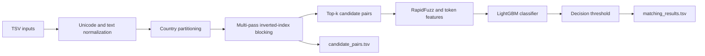

# Amazon ML Challenge 2026: Business Entity Resolution

A memory-aware entity-resolution pipeline for matching every deduplicated Source 1 business against the complete set of matching Source 2 and Source 3 businesses.

The solution combines country-partitioned, multi-pass blocking with a LightGBM pairwise classifier. It supports exact one-to-many matching, explicitly models singleton entities, and calibrates its decision threshold for the challenge's macro $F_{0.5}$ metric.

## Contents

- [Problem](#problem)
- [Solution overview](#solution-overview)
- [Current artifact status](#current-artifact-status)
- [Methodology](#methodology)
- [Dataset](#dataset)
- [Setup](#setup)
- [End-to-end workflow](#end-to-end-workflow)
- [Command-line configuration](#command-line-configuration)
- [Outputs and submission format](#outputs-and-submission-format)
- [Validation](#validation)
- [Recorded validation results](#recorded-validation-results)
- [Notebooks](#notebooks)
- [Repository structure](#repository-structure)
- [Limitations and reproducibility](#limitations-and-reproducibility)

## Problem

The challenge provides three business-record sources:

- **Source 1** is the deduplicated reference set. Every Source 1 entity must appear in the final output.
- **Source 2 and Source 3** contain additional business records.
- Each Source 1 entity may match **zero, one, or many** entities across Source 2 and Source 3.

This is exact set retrieval, not single-candidate ranking. A Source 1 entity with three true matches must return all three IDs. A Source 1 entity with no true matches must be represented by an empty prediction.

The official score is the macro average of entity-level $F_{0.5}$. This places more weight on precision than on recall, while giving a score of `1.0` to a correctly identified singleton and `0.0` to a singleton assigned any false match.

## Solution overview



### Main design choices

1. **Country is a hard partition.** No cross-country candidate pairs are generated.
2. **Blocking is recall-oriented but bounded.** Complementarily indexed name and address signals reduce each Source 1 entity to at most 35 candidates by default.
3. **The classifier resolves blocking ambiguity.** A LightGBM model evaluates 17 textual, structural, blocking-score, and ranking features.
4. **The threshold is optimized for the challenge metric.** Training searches thresholds from `0.35` to `0.80` in increments of `0.05`; inference defaults to `0.65`.
5. **Inference is memory-conscious.** Test files are processed one country at a time, candidate positions use compact integer arrays, pool attributes are computed lazily, and scoring is batched.
6. **One-to-many matches are preserved.** The pipeline emits every accepted candidate rather than selecting only a best match.

The canonical implementation is under [`code/business_entity_resolution/`](code/business_entity_resolution/). The notebooks provide analysis and an experimental walkthrough; the `src` package is the authoritative production path.

## Current artifact status

> **Read before running full inference**
>
> - The tracked `output/matching_results.tsv` and `output/candidate_pairs.tsv` currently contain headers only. Regenerate them before submission.
> - The tracked model is [`models/lgbm_matcher.txt`](models/lgbm_matcher.txt), a LightGBM v4 binary classifier trained with the repository's local sample workflow.
> - The current TSV files use ISO country values such as `US`, `FR`, and `IN`, while `src/inference.py` currently defaults to `France`, `US`, and `India` and restricts its CLI choices to those labels. Aligning those labels with `FR`, `US`, and `IN` is required for a complete run. A no-code-change invocation for the current data is provided in [Run inference](#run-inference).
> - The current blocker implements four candidate-index channels. Character 3-gram similarity is computed later as a model feature, even though the blocker module docstring lists it as an indexing channel.

## Methodology

### 1. Text normalization

[`preprocess.py`](code/business_entity_resolution/src/preprocess.py) applies deterministic, language-agnostic transformations:

- Unicode NFKD decomposition and removal of combining accents.
- Lowercasing and punctuation removal.
- Whitespace collapse.
- Domain-style business names reduced to their meaningful domain label.
- Common English and French legal-form removal for the normalized core name.
- Name and address token extraction with a minimum token length of three.
- Character 3-gram generation for typo-tolerant name similarity.
- Numeric token extraction for building, plot, postal, and PIN identifiers.

The core-name transformation removes common suffixes such as `inc`, `llc`, `ltd`, `pvt`, `sarl`, `sas`, and `snc`. If normalization removes every token, the original normalized name is retained.

### 2. Candidate blocking

[`blocking.py`](code/business_entity_resolution/src/blocking.py) builds a separate inverted index for every country and pool. The current implementation uses four channels:

| Channel | Purpose | Default behavior |
| --- | --- | --- |
| Exact core name | High-precision business-name matches | Adds a strong score for identical normalized core names |
| Name tokens | Recall for reordered, abbreviated, or noisy names | Uses frequency-discounted weights for tokens of length at least three |
| Address tokens | Recall from partial or abbreviated addresses | Suppresses very frequent address tokens |
| Address numbers | House, plot, postal, and PIN anchors | Used only for posting lists of at most 500 records |

Name and address tokens occurring more than `max(200, 0.5% of the country pool)` times are excluded from the token indices. Candidate scores are merged across channels, sorted, deduplicated by pool position, and truncated to `top_k=35` by default.

This stage defines the candidate-recall ceiling: a true match omitted during blocking cannot be recovered by the downstream classifier.

### 3. Pairwise features

[`features.py`](code/business_entity_resolution/src/features.py) produces a 17-dimensional feature vector:

**Name features**

- RapidFuzz normalized, partial, token-sort, and token-set ratios.
- Core-name ratio.
- Word-token Jaccard similarity.
- Character 3-gram Jaccard similarity.

**Address features**

- RapidFuzz normalized, token-sort, and token-set ratios.
- Address-token Jaccard similarity.
- Numeric-token Jaccard similarity.
- Binary numeric-token overlap.
- Candidate-address-missing indicator.

**Candidate context**

- Raw blocking score.
- Candidate rank.
- Combined name-and-address token-set ratio.

### 4. Model training

[`train_model.py`](code/business_entity_resolution/src/train_model.py) performs the following workflow:

1. Load the local validation sample.
2. Randomly split Source 1 into 70% training and 30% threshold-tuning partitions with seed `42`.
3. Build blocking candidates independently for each partition against the combined Source 2 and Source 3 pool.
4. Label candidates as positive when the pool ID appears in that Source 1 entity's ground-truth set.
5. Train a binary LightGBM gradient-boosted decision-tree model.
6. Use early stopping and save the model artifact.
7. Search decision thresholds by directly maximizing validation macro $F_{0.5}$.

Default model parameters:

| Parameter | Value |
| --- | ---: |
| Objective | `binary` |
| Metric | `binary_logloss` |
| Boosting type | `gbdt` |
| Leaves | `63` |
| Learning rate | `0.08` |
| Feature fraction | `0.85` |
| Boosting rounds | `300` |
| Early-stopping rounds | `20` |
| Training workers | `8` |
| Seed | `42` |

### 5. Evaluation metric

For a non-singleton Source 1 entity with true set $Y$ and predicted set $\hat{Y}$:

$$
F_{0.5} = \frac{1.25 \cdot Precision \cdot Recall}{0.25 \cdot Precision + Recall}
$$

Singleton behavior is handled explicitly:

| Ground truth | Prediction | Entity score |
| --- | --- | ---: |
| Empty | Empty | `1.0` |
| Empty | One or more IDs | `0.0` |
| One or more IDs | Empty | `0.0` |

[`metrics.py`](code/business_entity_resolution/src/metrics.py) reports macro $F_{0.5}$, non-singleton $F_{0.5}$, singleton accuracy, micro precision, and micro recall.

### 6. Memory-aware inference

[`inference.py`](code/business_entity_resolution/src/inference.py) avoids materializing the full all-country comparison space:

- Reads one country partition at a time with Polars.
- Combines Source 2 and Source 3 only within that country.
- Stores candidates as compact pool positions rather than repeatedly copying ID strings.
- Builds attributes lazily only for Source 1 and candidate-referenced pool rows.
- Caches up to 100,000 candidate-pool attribute tuples.
- Scores features in batches of 50,000.
- Writes results and releases country-level state before continuing.

## Dataset

The challenge data is not tracked in this repository. Place the files under `dataset/` using the layout expected by the source code.

```text
dataset/
├── train/
│   ├── train_source1.tsv
│   ├── train_source2.tsv
│   ├── train_source3.tsv
│   └── train_ground_truth.tsv
├── test/
│   ├── test_source1.tsv
│   ├── test_source2.tsv
│   └── test_source3.tsv
└── val_sample/
    ├── sample_source1.tsv
    ├── sample_source2.tsv
    ├── sample_source3.tsv
    └── sample_ground_truth.tsv
```

The `dataset/` directory is ignored by Git and must be created or populated locally.

### Source schema

| Column | Type | Meaning |
| --- | --- | --- |
| `entity_id` | string | Source-specific business identifier, such as an `S1-`, `S2-`, or `S3-` prefixed ID |
| `business_name` | string | Registered or observed business name |
| `business_address` | string | Free-form address; may be empty in Source 2 and Source 3 |
| `country` | string | ISO country value; the checked-in data uses codes such as `US`, `FR`, and `IN` |

Ground truth uses two columns:

| Column | Meaning |
| --- | --- |
| `source1_entity_id` | The Source 1 entity whose complete match set is required |
| `matched_entity_ids` | Comma-separated Source 2/3 IDs; empty for a singleton |

All challenge files are UTF-8, tab-separated values. Pandas and Polars must be configured with `sep="\t"` or `separator="\t"`; comma-separated input is invalid.

## Setup

### Prerequisites

- Python `3.10+` because the source uses modern type syntax.
- A Unix-like shell for the commands below.
- Sufficient RAM and temporary disk space for country-level inference and local validation sampling.
- A LightGBM-compatible CPU environment. GPU configuration is not required by the current implementation.

The main dependencies are declared in [`code/business_entity_resolution/requirements.txt`](code/business_entity_resolution/requirements.txt):

| Package | Purpose |
| --- | --- |
| `numpy` | Numeric arrays and batching |
| `pandas` | Training, sample creation, and validation-set processing |
| `polars` | Country-partitioned test loading |
| `scikit-learn` | Notebook experiments and supporting ML utilities |
| `lightgbm` | Pairwise classifier training and inference |
| `rapidfuzz` | Fast string-similarity features |
| `tqdm` | Blocking and scoring progress bars |

### Create an environment

Run from the repository root:

```bash
python3 -m venv venv
source venv/bin/activate
python -m pip install --upgrade pip
python -m pip install -r code/business_entity_resolution/requirements.txt
```

On Windows, activate `.venv\Scripts\Activate.ps1` instead. The repository currently uses `venv/` in its examples and ignores that directory.

Verify the core imports:

```bash
python -c "import lightgbm, numpy, pandas, polars, rapidfuzz; print('Dependencies ready')"
```

### Optional notebook environment

The exploratory notebooks additionally use notebook and plotting tools that are not required by the production `src` pipeline:

```bash
python -m pip install jupyterlab matplotlib seaborn
```

## End-to-end workflow

All commands below are intended to run from the repository root. Setting `PYTHONPATH` allows Python to resolve the `src` package without changing directories.

### 1. Place the data

Populate `dataset/train/` and `dataset/test/` with the challenge TSV files. Confirm that the `country` values are represented consistently in all sources.

### 2. Create a local validation sample

[`create_sample.py`](code/business_entity_resolution/src/create_sample.py) targets 50,000 Source 1 entities and stratifies them by country and singleton status. It retains every true Source 2/3 match and adds up to two random distractors per true match.

```bash
PYTHONPATH=code/business_entity_resolution python3 -m src.create_sample
```

The helper loads complete training Source 2 and Source 3 files with pandas, so this step can require substantial memory even though the resulting sample is small. The command does not expose CLI options; import `create_sample(...)` from Python to change its input directory, output directory, sample target, or seed.

### 3. Train the classifier

```bash
PYTHONPATH=code/business_entity_resolution python3 -m src.train_model
```

Expected artifact:

```text
models/lgbm_matcher.txt
```

The training command prints pair counts, class balance, LightGBM feature importances, and the complete threshold sweep. It optimizes threshold selection but does not modify the inference module's default threshold.

### 4. Run inference

The intended module interface is:

```bash
PYTHONPATH=code/business_entity_resolution python3 -m src.inference \
    --test-dir dataset/test \
    --model-path models/lgbm_matcher.txt \
    --output-dir output \
    --threshold 0.65 \
    --top-k 35
```

For the current TSV country values, the checked-in CLI choices for France and India are mismatched. Without editing source code, invoke the same function with ISO values:

```bash
PYTHONPATH=code/business_entity_resolution python3 -c "from src.inference import run_full_inference; run_full_inference(countries=['FR', 'US', 'IN'])"
```

The direct call uses the same test directory, model path, output directory, threshold, and top-k defaults as the module entry point. After source labels are aligned, prefer the normal module command with an explicit country list:

```bash
PYTHONPATH=code/business_entity_resolution python3 -m src.inference \
    --test-dir dataset/test \
    --model-path models/lgbm_matcher.txt \
    --output-dir output \
    --threshold 0.65 \
    --top-k 35 \
    --countries FR US IN
```

A complete run writes both required output files and should process every Source 1 entity represented in the selected country partitions.

### 5. Validate the outputs

```bash
python3 utils/validate_submission.py \
    --matching output/matching_results.tsv \
    --candidate output/candidate_pairs.tsv \
    --test-dir dataset/test
```

For the additional memory-intensive ID-existence diagnostic:

```bash
python3 utils/validate_submission.py \
    --matching output/matching_results.tsv \
    --candidate output/candidate_pairs.tsv \
    --test-dir dataset/test \
    --check-ids
```

### 6. Package the submission

Create a ZIP archive whose root contains:

```text
output/
├── matching_results.tsv
└── candidate_pairs.tsv
```

Do not submit the dataset, notebooks, model, or source code unless separately required by the challenge.

## Command-line configuration

### Inference options

| Option | Default | Description |
| --- | --- | --- |
| `--test-dir` | `dataset/test` | Directory containing `test_source1.tsv`, `test_source2.tsv`, and `test_source3.tsv` |
| `--model-path` | `models/lgbm_matcher.txt` | LightGBM model artifact |
| `--output-dir` | `output` | Destination for both generated TSV files |
| `--threshold` | `0.65` | Minimum classifier probability required for a match |
| `--top-k` | `35` | Maximum candidates retained per Source 1 entity |
| `--countries` | `France US India` | Country partitions to process; current CLI choices must match the TSV values |

### Training defaults

The training entry point is intentionally small and currently has no argument parser. Its defaults and fixed settings are:

| Setting | Value |
| --- | --- |
| Validation sample | `dataset/val_sample` |
| Model output | `models/lgbm_matcher.txt` |
| Source 1 split | 70% train / 30% validation |
| Random seed | `42` |
| Blocker top-k | `35` |
| Maximum frequent-token ratio | `0.005`, with a minimum cutoff of 200 postings |
| Threshold search | `0.35` through `0.80`, step `0.05` |
| Internal scoring batch size | `50,000` |
| Candidate attribute cache | `100,000` entries |

Use Python imports to call `train_and_evaluate(val_sample_dir, model_save_path)` with non-default paths.

## Outputs and submission format

### `output/matching_results.tsv`

This is the leaderboard-scored file. Its header must be exactly:

```text
source1_entity_id	matched_entity_ids
```

Using escaped `\t` notation to make the delimiter visible, each valid prediction has this shape:

```text
S1-000000001\tS2-000000002,S2-000000003,S3-000000004
S1-000000005\t
```

The second row represents a Source 1 singleton. It ends immediately after the tab, leaving the second field empty.

### `output/candidate_pairs.tsv`

This file records the candidate set produced before classification. Its header must be exactly:

```text
source1_entity_id	candidate_entity_ids
```

Accepted final matches should be a subset of the corresponding candidate list. The candidate file may contain false positives because candidates have not yet passed the model threshold.

### Format contract

- Use UTF-8 encoding.
- Use tabs between the two columns, not commas.
- Include exactly one row for every Source 1 entity in `test_source1.tsv`.
- Never repeat a Source 1 ID across rows.
- Never repeat an ID inside a comma-separated candidate or match list.
- Include only Source 2 and Source 3 IDs in candidate and match lists.
- Use an empty second field to represent no candidates or no matches.
- Do not include a DataFrame index, quotes, or an extra header.

## Validation

[`utils/validate_submission.py`](utils/validate_submission.py) is a standard-library checker for the local test files and generated outputs. It verifies:

- Exact headers and tab delimiters.
- UTF-8 readability.
- One and only one row per test Source 1 entity.
- Correct Source ID prefixes.
- No duplicate rows or repeated IDs within a list.
- Optional existence of every Source 2/3 ID when `--check-ids` is enabled.
- A warning when final matches are absent from the corresponding candidate list.

The default validation deliberately skips the memory-heavy ID-existence check. A nonexistent matched ID is a scoring error rather than a guaranteed format rejection, so the optional check is diagnostic.

The validator checks submission safety, not model quality. Use training validation metrics to measure quality.

## Recorded validation results

The following snapshot is recorded in [`Documentation_template.md`](Documentation_template.md) from an earlier local validation run:

| Metric | Recorded value |
| --- | ---: |
| Macro $F_{0.5}$ | `0.9562` |
| Non-singleton $F_{0.5}$ | `0.9578` |
| Singleton accuracy | `92.91%` |
| Micro precision | `98.42%` |
| Micro recall | `91.94%` |
| US candidate recall | `95.45%` |
| India candidate recall | `92.58%` |
| Selected threshold | `0.65` |

These are historical local validation figures, not a current leaderboard score and not evidence that the checked-in header-only outputs are complete. Reproduce them with the documented sample, training, and inference workflow before relying on them for model selection.

## Notebooks

### `EDA_and_Data_Profiling.ipynb`

Exploratory data analysis and large-scale profiling over the challenge files. The notebook uses Polars and visualization tools to examine schema, country distribution, missingness, duplication, string lengths, and candidate-matching patterns. Full-dataset profiling is memory-intensive.

### `Entity_Resolution_Pipeline.ipynb`

A notebook-based end-to-end walkthrough of normalization, blocking, feature creation, training, and prediction. It is useful for inspection and experimentation, but it is not the authoritative runtime path. Its parameters and intermediate design may differ from the production package in `code/business_entity_resolution/src/`.

Neither notebook is required to train or run the production pipeline.

## Repository structure

```text
.
├── .gitignore
├── README.md
├── Documentation_template.md
├── EDA_and_Data_Profiling.ipynb
├── Entity_Resolution_Pipeline.ipynb
├── 6ab5628d5a817_amazon_ml_challenge_problem_statement.pdf
├── 6ab56657b4f1a_guidelines_and_key_instructions_amazon_ml_challenge_2026.pdf
├── code/
│   └── business_entity_resolution/
│       ├── README.md
│       ├── requirements.txt
│       └── src/
│           ├── __init__.py
│           ├── blocking.py
│           ├── create_sample.py
│           ├── features.py
│           ├── inference.py
│           ├── metrics.py
│           ├── preprocess.py
│           └── train_model.py
├── dataset/                         # Local-only; ignored by Git
│   ├── train/
│   ├── test/
│   └── val_sample/
├── models/
│   └── lgbm_matcher.txt
├── output/
│   ├── candidate_pairs.tsv
│   └── matching_results.tsv
├── utils/
│   └── validate_submission.py
└── venv/                            # Local-only; ignored by Git
```

### Tracked versus local artifacts

Tracked:

- Documentation, notebooks, and challenge reference PDFs.
- Production source and requirements.
- The trained LightGBM model.
- Output-format placeholders and the submission validator.

Local and ignored:

- `dataset/`, because the challenge data is too large and governed by external terms.
- `venv/`, because environments are machine-specific.
- Python bytecode caches and local experimental artifacts.

## Limitations and reproducibility

### Modeling limitations

- **Blocking recall ceiling:** the model cannot score a true pair that the blocker omits.
- **France zero-shot inference:** France is absent from the audited training countries, so French names and addresses depend on language-agnostic normalization and cross-country transfer.
- **Transliteration:** heavy script conversion and phonetic spelling differences remain difficult when both name and address representations differ.
- **Franchises and branches:** similar names at nearby addresses can produce false positives.
- **One-to-many output:** no one-to-one constraint is imposed, as required by the task; threshold calibration controls over-merging.
- **Country-label dependency:** blocking assumes compatible country partitions; the current inference label mismatch must be resolved for a complete run.

### Reproducibility controls

- Sampling, splitting, model training, and LightGBM use fixed seed `42`.
- Production code contains no pretrained external-data component.
- Requirements specify minimum versions rather than a fully locked environment, so a lock file is recommended for bit-for-bit environment reproduction.
- Recorded metrics are historical and should be regenerated after any data, feature, hyperparameter, threshold, or dependency change.

### Data and license status

The challenge dataset is not redistributed here. Obtain it through the official challenge materials and comply with its data-use terms. No root `LICENSE` file is currently tracked; confirm licensing with the repository owner before redistributing this project or its model artifacts.

## Challenge references

The repository includes the supplied reference documents:

- [Amazon ML Challenge 2026 problem statement](6ab5628d5a817_amazon_ml_challenge_problem_statement.pdf)
- [Guidelines and key instructions for Amazon ML Challenge 2026](6ab56657b4f1a_guidelines_and_key_instructions_amazon_ml_challenge_2026.pdf)
